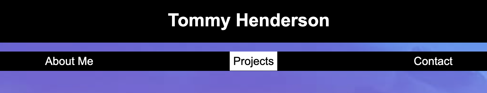
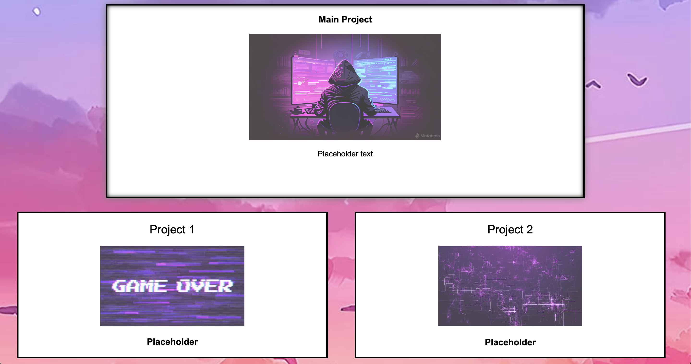

# Tommy Henderson Professional Portfolio

## Description

[Tommy Henderson Professional Portfolio](https://tommy-henderson.github.io/Professional-Portfolio/)

Built a site to keep track of the projects that I will be working on throughout the course. Also wanted to practice the HTML and CSS we have learned in the first couple of weeks of class. Specifically flexbox, media queries, and CSS variables. Will continue to refine the site to eventually use as a portfolio. 

## Installation

N/A

## Usage

Can use navbar to navigate the page. 

As I continue throughout this course, I will be replacing the placeholders with links to completed projects. The user will be able to click on project cards to be taken to the projects I have worked on.

## Credits

N/A

## License

Please refer to the LICENSE in the repo.

